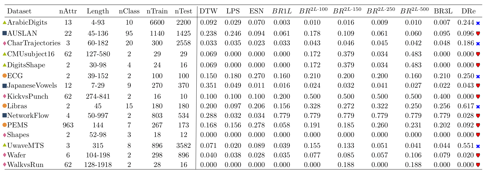

# Time-Series Dataset Readers

* multivarReader.py

  Read multivariate time series (MTS) datasets used by Mustafa Baydogan. The data is in mat format.
  
  Mustafa Baydogan's MTS datasets can be obtained from:
  http://www.mustafabaydogan.com/files/viewdownload/20-data-sets/69-multivariate-time-series-classification-data-sets-in-matlab-format.html

  This dataset was used in 
  * "A Very Concise Feature Representation For Time Series Classification Understanding" (http://www.mva-org.jp/Proceedings/2019/papers/02-21.pdf), In the 16th International Conference on Machine Vision Applications (MVA), 2019, and 
  
  * "Dimensionality Reduction for Visualization of Time Series and Trajectories" (https://link.springer.com/chapter/10.1007/978-3-030-20205-7_21), In the 21st Scandinavian Conference on Image Analysis (SCIA), pages: 246-257, 2019.
   

    The characteristics of 15 datasets and their error rates in ten classifiers from "A Very Concise Feature Representation For Time Series Classification Understanding".
    
    
 
